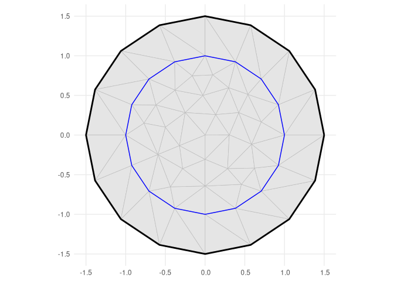
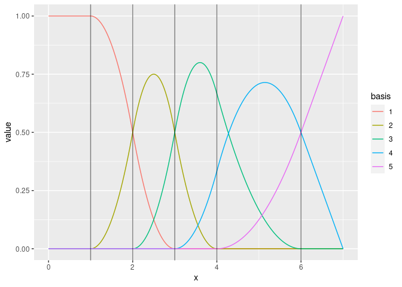

<!-- README.md is generated from README.Rmd. Please edit that file -->

# fmesher: Triangle Meshes and Other Geometry Tools

<!-- badges: start -->
<!-- [](https://cran.r-project.org/package=fmesher) -->

[](https://inlabru-org.r-universe.dev)
[](https://github.com/inlabru-org/fmesher/actions)
[](https://github.com/inlabru-org/fmesher/actions)
[](https://app.codecov.io/gh/inlabru-org/fmesher?branch=devel)
<!-- badges: end -->

Generate planar and spherical triangle meshes, compute finite element
calculations for 1- and 2-dimensional flat and curved manifolds with
associated basis function spaces, methods for lines and polygons, and
transparent handling of coordinate reference systems and coordinate
transformation, including ‘sf’ and ‘sp’ geometries. The core ‘fmesher’
library code was originally part of the [`INLA`](https://www.r-inla.org)
package, and also distributed in the [EUSTACE Horizon 2020
project](https://github.com/eustace-data/eustace-ambitious), and
implements parts of “Triangulations and Applications” by [Hjelle and
Dæhlen (2006)](https://doi.org/10.1007/3-540-33261-8). The expanded
crs/CRS support started as an add-on feature of
[`inlabru`](https://inlabru-org.github.io/inlabru/).

## Installation

You can install the current [CRAN](https://CRAN.R-project.org) version
of `fmesher`:

``` r
install.packages("fmesher")
```

You can install the latest stable release of `fmesher` from
[GitHub](https://github.com/):

``` r
# install.packages("remotes")
remotes::install_github("inlabru-org/fmesher", ref = "stable")
```

And the development version with:

``` r
# install.packages("remotes")
remotes::install_github("inlabru-org/fmesher")
```

or track the development version builds via
[inlabru-org.r-universe.dev](https://inlabru-org.r-universe.dev/builds):

``` r
# Enable universe(s) by inlabru-org
options(repos = c(
  inlabruorg = "https://inlabru-org.r-universe.dev",
  INLA = "https://inla.r-inla-download.org/R/testing",
  CRAN = "https://cloud.r-project.org"
))

install.packages("fmesher")
```

To install and run `fmesher` in full debug mode (this is quite an
experience!), use

``` r
# install.packages("pkgbuild")
source("https://raw.githubusercontent.com/inlabru-org/fmesher/devel/misc/build.R")
fmesher_install(repo = "inlabru-org/fmesher", debug = TRUE)
```

## Online documentation

<https://inlabru-org.github.io/fmesher/>

## Examples

### 2D triangular meshes

Includes a port of inla mesh `inla.mesh.create` (as `fm_rcdt_2d_inla()`)
and `inla.mesh.2d` interfaces.

``` r
suppressPackageStartupMessages(library(fmesher))
suppressPackageStartupMessages(library(ggplot2))

(mesh <- fm_mesh_2d_inla(
  boundary = fm_extensions(cbind(0, 0), convex = c(1, 1.5)),
  max.edge = c(0.5, 1)
))
#> fm_mesh_2d object:
#>   Manifold:  R2
#>   V / E / T: 57 / 152 / 96
#>   Euler char.:   1
#>   Constraints:   16 boundary edges (1 group: 1), 16 interior edges (1 group: 1)
#>   Bounding box: (-1.499887, 1.499887) x (-1.499887, 1.499887) x (0,0)
#>   Basis d.o.f.:  57
```

``` r
ggplot() +
  geom_fm(data = mesh) +
  theme_minimal()
```



### 1D B-spline function spaces

``` r
(mesh <- fm_mesh_1d(c(1, 2, 3, 4, 6),
  boundary = c("neumann", "free"),
  degree = 2
))
#> fm_mesh_1d object:
#>   Manifold:  R1
#>   #{knots}:  5
#>   Interval:  (1, 6)
#>   Boundary:  (neumann, free)
#>   B-spline degree:   2
#>   Basis d.o.f.:  5
```

``` r
ggplot() +
  geom_fm(data = mesh, xlim = c(0, 7))
```



### Extended helper methods for CRS handling

The package provides methods `fm_crs()` and `fm_CRS()` for extracting
CRS information from `sf` and `sp` objects and automatically converts to
the desired output format. The `fm_transform()` wrapper similarly
handles a variety of objects, as well as special handling for converting
between spheres and globes of different radii, e.g. used to map between
the Earth and a unit radius sphere uses as a model of the Earth.

``` r
# longlat for a spherical version of the Earth
print(fm_crs("longlat_globe"))
#> Coordinate Reference System:
#>   User input: +proj=longlat +ellps=sphere +no_defs 
#>   wkt:
#> GEOGCRS["unknown",
#>     DATUM["Unknown based on Normal Sphere (r=6370997) ellipsoid",
#>         ELLIPSOID["Normal Sphere (r=6370997)",6370997,0,
#>             LENGTHUNIT["metre",1,
#>                 ID["EPSG",9001]]]],
#>     PRIMEM["Greenwich",0,
#>         ANGLEUNIT["degree",0.0174532925199433],
#>         ID["EPSG",8901]],
#>     CS[ellipsoidal,2],
#>         AXIS["longitude",east,
#>             ORDER[1],
#>             ANGLEUNIT["degree",0.0174532925199433,
#>                 ID["EPSG",9122]]],
#>         AXIS["latitude",north,
#>             ORDER[2],
#>             ANGLEUNIT["degree",0.0174532925199433,
#>                 ID["EPSG",9122]]]]

# longlat for a sphere of radius 1m
print(fm_crs("longlat_norm"))
#> Coordinate Reference System:
#>   User input: +proj=longlat +R=1 +no_defs 
#>   wkt:
#> GEOGCRS["unknown",
#>     DATUM["unknown",
#>         ELLIPSOID["unknown",1,0,
#>             LENGTHUNIT["metre",1,
#>                 ID["EPSG",9001]]]],
#>     PRIMEM["Reference meridian",0,
#>         ANGLEUNIT["degree",0.0174532925199433,
#>             ID["EPSG",9122]]],
#>     CS[ellipsoidal,2],
#>         AXIS["longitude",east,
#>             ORDER[1],
#>             ANGLEUNIT["degree",0.0174532925199433,
#>                 ID["EPSG",9122]]],
#>         AXIS["latitude",north,
#>             ORDER[2],
#>             ANGLEUNIT["degree",0.0174532925199433,
#>                 ID["EPSG",9122]]]]

# A sphere of radius 1m
print(fm_crs("sphere"))
#> Coordinate Reference System:
#>   User input: +proj=geocent +R=1 +units=m +no_defs 
#>   wkt:
#> GEODCRS["unknown",
#>     DATUM["unknown",
#>         ELLIPSOID["unknown",1,0,
#>             LENGTHUNIT["metre",1,
#>                 ID["EPSG",9001]]]],
#>     PRIMEM["Reference meridian",0,
#>         ANGLEUNIT["degree",0.0174532925199433,
#>             ID["EPSG",9122]]],
#>     CS[Cartesian,3],
#>         AXIS["(X)",geocentricX,
#>             ORDER[1],
#>             LENGTHUNIT["metre",1,
#>                 ID["EPSG",9001]]],
#>         AXIS["(Y)",geocentricY,
#>             ORDER[2],
#>             LENGTHUNIT["metre",1,
#>                 ID["EPSG",9001]]],
#>         AXIS["(Z)",geocentricZ,
#>             ORDER[3],
#>             LENGTHUNIT["metre",1,
#>                 ID["EPSG",9001]]]]
```
