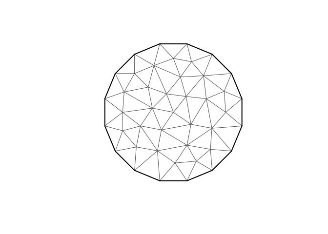

<!-- README.md is generated from README.Rmd. Please edit that file -->

# fmesher: Triangle Meshes and Other Geometry Tools

<!-- badges: start -->

[](https://inlabru-org.r-universe.dev)
[](https://github.com/inlabru-org/fmesher/actions)
[](https://github.com/inlabru-org/fmesher/actions)
[](https://codecov.io/gh/inlabru-org/fmesher?branch=devel)
<!-- badges: end -->

Functions that generate planar and spherical triangle meshes, computes
finite element calculations for 1- and 2-dimensional flat and curved
manifolds, functions for lines and polygons, and transparent handling of
crs information and coordinate transformation, including and
interoperability with `sf` and `sp` geometries. Experimental package
that will take over the relevant subset of features from the
[INLA](https://www.r-inla.org) and
[inlabru](https://inlabru-org.github.io/inlabru/) packages, as well as
extend them.

## Installation

You can install the latest stable release of `fmesher` from
[GitHub](https://github.com/):

``` r
# install.packages("remotes")
remotes::install_github("inlabru-org/fmesher", ref = "stable")
```

And the development version with:

``` r
# install.packages("remotes")
remotes::install_github("inlabru-org/fmesher")
```

or track the development version builds via
[inlabru-org.r-universe.dev](https://inlabru-org.r-universe.dev/builds):

``` r
# Enable universe(s) by inlabru-org
options(repos = c(
  inlabruorg = "https://inlabru-org.r-universe.dev",
  INLA = "https://inla.r-inla-download.org/R/testing",
  CRAN = "https://cloud.r-project.org"
))

install.packages("fmesher")
```

Note that you need the `feature/fmesher` branch of `inlabru` until that
is merged into the main development branch:

``` r
# install.packages("remotes")
remotes::install_github("inlabru-org/inlabru@feature/fmesher")
```

To install and run `fmesher` in full debug mode (this is quite an
experience!), use

``` r
# install.packages("pkgbuild")
source("https://raw.githubusercontent.com/inlabru-org/fmesher/devel/misc/build.R")
fmesher_install(repo = "inlabru-org/fmesher", debug = TRUE)
```

## Online documentation

<https://inlabru-org.github.io/fmesher/>

## Example

``` r
suppressPackageStartupMessages(library(fmesher))

# Port of the old inla mesh inla.mesh.create interface:
plot(fm_rcdt_2d_inla(
  cbind(0, 0),
  extend = list(offset = 1, n = 16L),
  refine = list(max.edge = 0.5)
), asp = 1)
```



``` r

# longlat for a spherical version of the Earth
print(fm_crs("longlat_globe"))
#> Coordinate Reference System:
#>   User input: +proj=longlat +ellps=sphere +no_defs 
#>   wkt:
#> GEOGCRS["unknown",
#>     DATUM["Unknown based on Normal Sphere (r=6370997) ellipsoid",
#>         ELLIPSOID["Normal Sphere (r=6370997)",6370997,0,
#>             LENGTHUNIT["metre",1,
#>                 ID["EPSG",9001]]]],
#>     PRIMEM["Greenwich",0,
#>         ANGLEUNIT["degree",0.0174532925199433],
#>         ID["EPSG",8901]],
#>     CS[ellipsoidal,2],
#>         AXIS["longitude",east,
#>             ORDER[1],
#>             ANGLEUNIT["degree",0.0174532925199433,
#>                 ID["EPSG",9122]]],
#>         AXIS["latitude",north,
#>             ORDER[2],
#>             ANGLEUNIT["degree",0.0174532925199433,
#>                 ID["EPSG",9122]]]]

# longlat for a sphere of radius 1m
print(fm_crs("longlat_norm"))
#> Coordinate Reference System:
#>   User input: +proj=longlat +R=1 +no_defs 
#>   wkt:
#> GEOGCRS["unknown",
#>     DATUM["unknown",
#>         ELLIPSOID["unknown",1,0,
#>             LENGTHUNIT["metre",1,
#>                 ID["EPSG",9001]]]],
#>     PRIMEM["Reference meridian",0,
#>         ANGLEUNIT["degree",0.0174532925199433,
#>             ID["EPSG",9122]]],
#>     CS[ellipsoidal,2],
#>         AXIS["longitude",east,
#>             ORDER[1],
#>             ANGLEUNIT["degree",0.0174532925199433,
#>                 ID["EPSG",9122]]],
#>         AXIS["latitude",north,
#>             ORDER[2],
#>             ANGLEUNIT["degree",0.0174532925199433,
#>                 ID["EPSG",9122]]]]

# A sphere of radius 1m
print(fm_crs("sphere"))
#> Coordinate Reference System:
#>   User input: +proj=geocent +R=1 +units=m +no_defs 
#>   wkt:
#> GEODCRS["unknown",
#>     DATUM["unknown",
#>         ELLIPSOID["unknown",1,0,
#>             LENGTHUNIT["metre",1,
#>                 ID["EPSG",9001]]]],
#>     PRIMEM["Reference meridian",0,
#>         ANGLEUNIT["degree",0.0174532925199433,
#>             ID["EPSG",9122]]],
#>     CS[Cartesian,3],
#>         AXIS["(X)",geocentricX,
#>             ORDER[1],
#>             LENGTHUNIT["metre",1,
#>                 ID["EPSG",9001]]],
#>         AXIS["(Y)",geocentricY,
#>             ORDER[2],
#>             LENGTHUNIT["metre",1,
#>                 ID["EPSG",9001]]],
#>         AXIS["(Z)",geocentricZ,
#>             ORDER[3],
#>             LENGTHUNIT["metre",1,
#>                 ID["EPSG",9001]]]]
```
