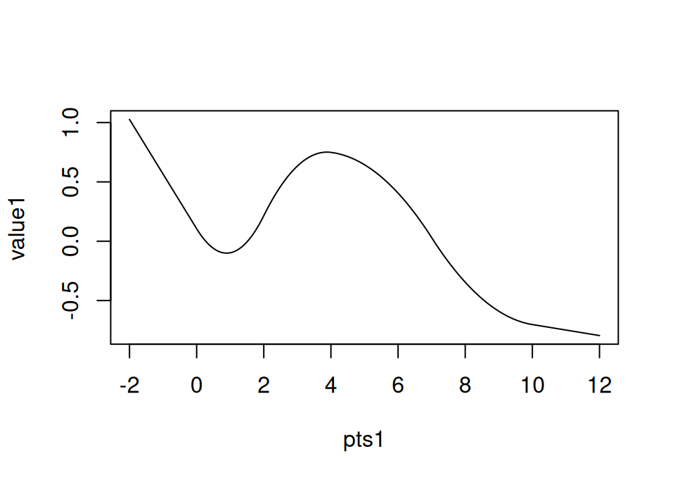
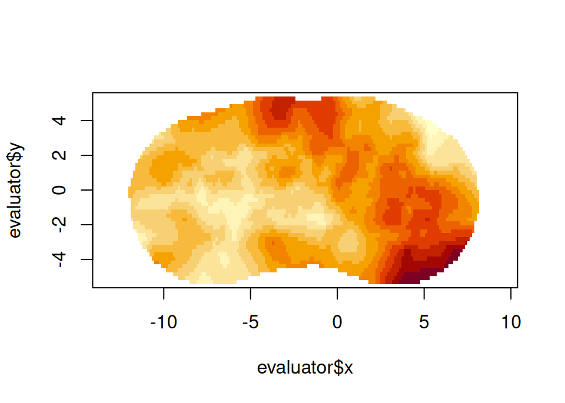

# Basic fmesher use

``` r
suppressPackageStartupMessages(library(fmesher))
set.seed(1234L)
```

## Mesh construction

``` r
domain <- cbind(rnorm(4, sd = 3), rnorm(4))
(mesh2 <- fm_mesh_2d(
  boundary = fm_extensions(domain, c(2.5, 5)),
  max.edge = c(0.5, 2)
))
#> fm_mesh_2d object:
#>   Manifold:  R2
#>   V / E / T: 911 / 2685 / 1775
#>   Euler char.:   1
#>   Constraints:   Boundary: 45 boundary edges (1 group: 1), Interior: 127 interior edges (1 group: 1)
#>   Bounding box: (-11.976144,  8.248637) x (-5.528888, 5.506054)
#>   Basis d.o.f.:  911
```

``` r
(mesh1 <- fm_mesh_1d(
  c(0, 2, 4, 7, 10),
  boundary = "free", # c("neumann", "dirichlet"),
  degree = 2
))
#> fm_mesh_1d object:
#>   Manifold:  R1
#>   #{knots}:  5
#>   Interval:  ( 0, 10)
#>   Boundary:  (free, free)
#>   B-spline degree:   2
#>   Basis d.o.f.:  6
```

## Point lookup and evaluation

``` r
pts <- cbind(rnorm(400, sd = 3), rnorm(400))

# Find what triangle each point is in, and its triangular Barycentric
# coordinates
bary <- fm_bary(mesh2, loc = pts)
head(bary)
#> # A tibble: 6 × 2
#>   index where[,1]  [,2]   [,3]
#>   <int>     <dbl> <dbl>  <dbl>
#> 1  1369     0.515 0.124 0.361 
#> 2   491     0.818 0.157 0.0254
#> 3  1521     0.679 0.234 0.0876
#> 4  1275     0.465 0.144 0.392 
#> 5  1054     0.785 0.158 0.0569
#> 6  1532     0.191 0.230 0.579
# How many points are outside the mesh?
sum(is.na(bary$index))
#> [1] 2
bary$where[is.na(bary$index), ]
#>      [,1] [,2] [,3]
#> [1,]   NA   NA   NA
#> [2,]   NA   NA   NA

# Evaluate basis functions
basis <- fm_basis(mesh2, loc = pts) # Raw SparseMatrix
basis_object <- fm_basis(mesh2, loc = pts, full = TRUE) # fm_basis object
sum(!basis_object$ok)
#> [1] 2

# Construct an evaluator object
evaluator <- fm_evaluator(mesh2, loc = pts)
sum(!fm_basis(evaluator, full = TRUE)$ok)
#> [1] 2

# Values for the basis function weights; for ordinary 2d meshes this coincides
# with the resulting values at the vertices, but this is not true for e.g.
# 2nd order B-splines on 1d meshes.
field <- mesh2$loc[, 1]
value <- fm_evaluate(evaluator, field = field)
sum(abs(pts[, 1] - value), na.rm = TRUE)
#> [1] 4.604303e-14
```

``` r
pts1 <- seq(-2, 12, length.out = 1000)

# Find what segment, and its interval Barycentric coordinates
bary1 <- fm_bary(mesh1, loc = pts1)
# Points outside the interval are treated differently depending on the
# boundary conditions:
sum(is.na(bary1$index))
#> [1] 0
head(bary1)
#> # A tibble: 6 × 2
#>   index where[,1]   [,2]
#>   <int>     <dbl>  <dbl>
#> 1     1      2    -1    
#> 2     1      1.99 -0.993
#> 3     1      1.99 -0.986
#> 4     1      1.98 -0.979
#> 5     1      1.97 -0.972
#> 6     1      1.96 -0.965

# Evaluate basis functions
basis1 <- fm_basis(mesh1, loc = pts1) # Raw SparseMatrix
basis1_object <- fm_basis(mesh1, loc = pts1, full = TRUE) # fm_basis object
sum(!basis1_object$ok)
#> [1] 0

# Construct an evaluator object.
evaluator1 <- fm_evaluator(mesh1, loc = pts1)
# mesh_1d basis functions are defined everywhere
sum(!fm_basis(evaluator1, full = TRUE)$ok)
#> [1] 0

# Values for the basis function weights; for ordinary 2d meshes this coincides
# with the resulting values at the vertices, but this is not true for e.g.
# 2nd order B-splines on 1d meshes.
field1 <- rnorm(fm_dof(mesh1))
value1 <- fm_evaluate(evaluator1, field = field1)
plot(pts1, value1, type = "l")
```



Evaluated 1D function

## Plotting

### Base graphics

``` r
plot(mesh2)
```


2D triangulation mesh (base graphics version)

### `ggplot` graphics

``` r
suppressPackageStartupMessages(library(ggplot2))
ggplot() +
  geom_fm(data = mesh2)
```


2D triangulation mesh (ggplot version)

``` r
ggplot() +
  geom_fm(data = mesh1, weights = field1 + 2, xlim = c(-2, 12)) +
  geom_fm(data = mesh1, linetype = 2, alpha = 0.5, xlim = c(-2, 12))
```


1D B-spline function space basis functions with evaluated function
(ggplot version)

## Finite element calculations

``` r
fem1 <- fm_fem(mesh1, order = 2)
names(fem1)
#> [1] "c0"  "c1"  "g1"  "g2"  "g01" "g02" "g12"
fem2 <- fm_fem(mesh2, order = 2)
names(fem2)
#> [1] "b1" "c0" "c1" "g1" "g2" "k1" "k2" "ta" "va"
```

## Stochastic process simulation

``` r
samp <- fm_matern_sample(mesh2, alpha = 2, rho = 4, sigma = 1)[, 1]
evaluator <- fm_evaluator(
  mesh2,
  lattice = fm_evaluator_lattice(mesh2, dims = c(150, 50))
)
image(evaluator$x, evaluator$y, fm_evaluate(evaluator, field = samp), asp = 1)
```



Simulated 2D Matérn field
