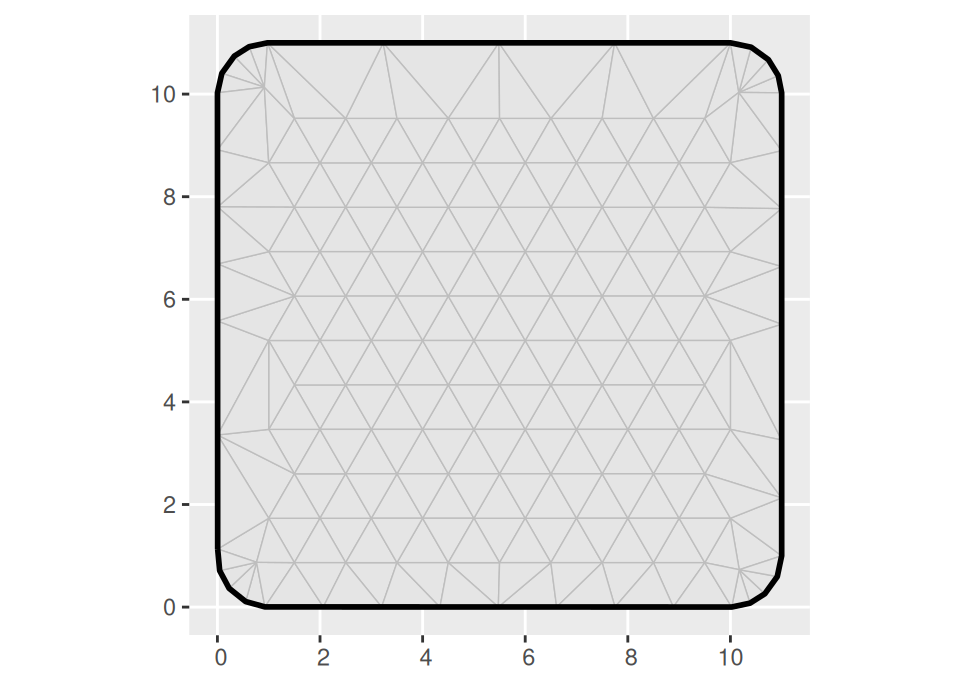
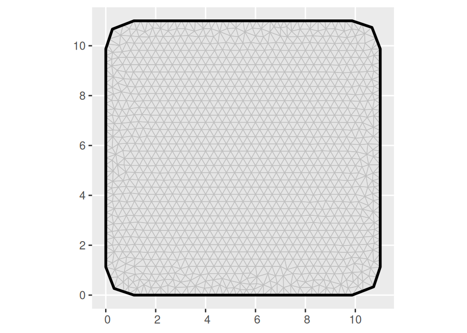
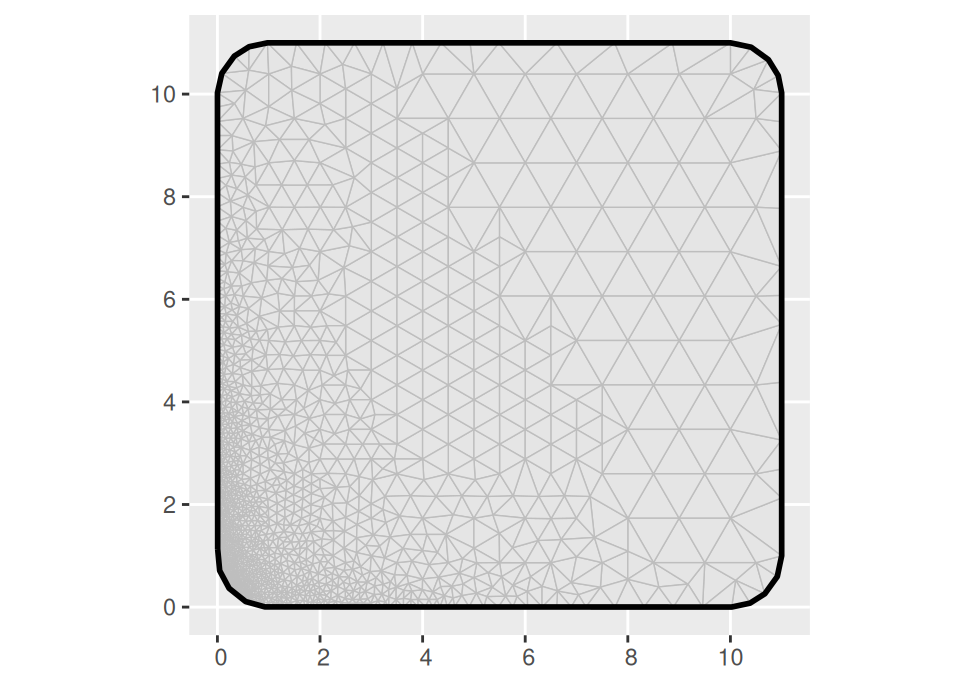
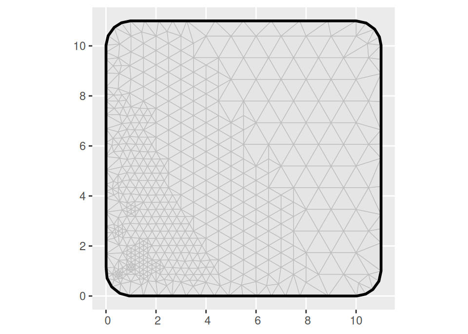
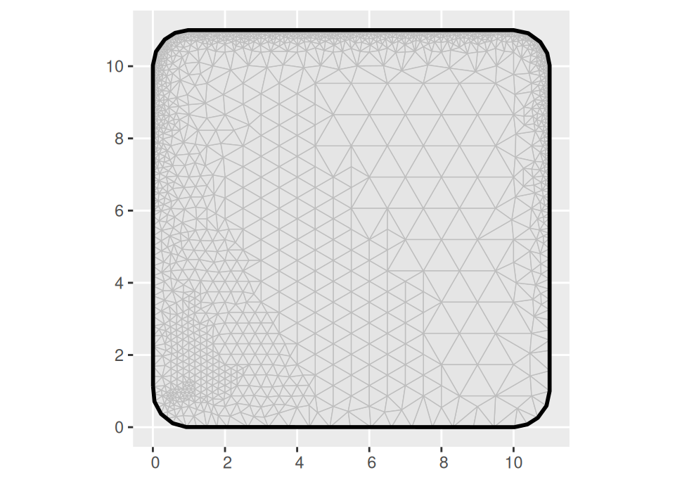
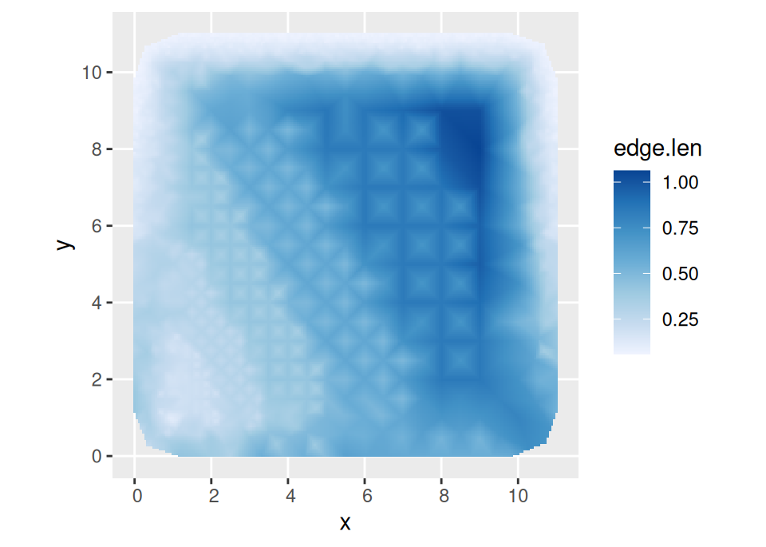
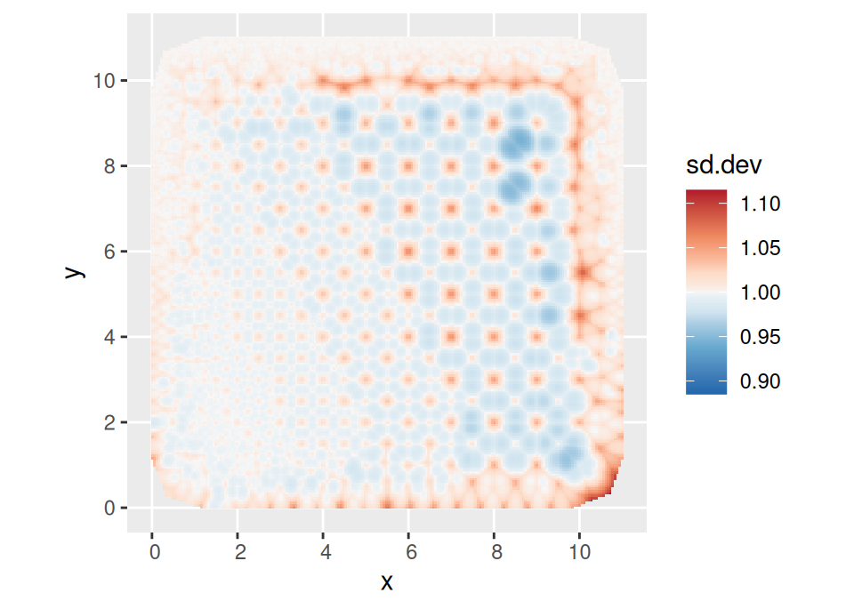
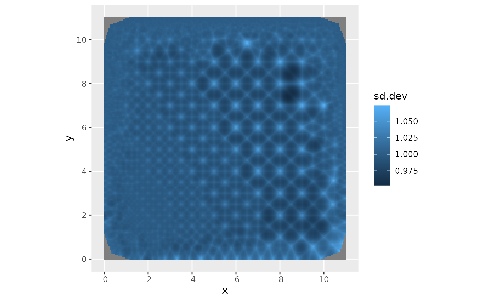

# Spatially varying mesh quality

Updated version of the 2018 blog post [Spatially varying mesh
quality](https://webhomes.maths.ed.ac.uk/~flindgre/posts/2018-07-22-spatially-varying-mesh-quality/).
Needs `fmesher` version `0.3.0.9005` or later.

## Fundamentals of triangle mesh refinement

The [fmesher](https://inlabru-org.github.io/fmesher/) package has
several features that aren’t widely known. The code started as an
implementation of the triangulation method detailed in [Hjelle and
Dæhlen, “Triangulations and Applications”
(2006)](https://link.springer.com/book/10.1007/3-540-33261-8), which
includes methods for spatially varying mesh quality.[¹](#fn1) Over time,
the interface and feature improvements focused on robustness and
calculating useful mesh properties, but the more advanced mesh quality
features are still there!

The algorithm first builds a basic mesh, including any points the user
specifies, as well as any boundary curves (if no boundary curve is
given, a default boundary will be added), connecting all the points into
a [Delaunay
triangulation](https://en.wikipedia.org/wiki/Delaunay_triangulation).

After this initial step, mesh quality is decided by two criteria:

1.  Minimum allowed angle in a triangle
2.  Maximum allowed triangle edge length

As long as any triangle does not fulfil the criteria, a new mesh point
is added in a way that is guaranteed to locally fix the problem, and a
new Delaunay triangulation is obtained. This process is repeated until
all triangles fulfil the criteria. In perfect arithmetic, the algorithm
is guaranteed to converge as long as the minimum angle criterion is at
most 21 degrees, and the maximum edge length criterion is strictly
positive.

A basic mesh with regular interior triangles can be created as follows:

``` r
library(ggplot2)
library(fmesher)

loc <- as.matrix(expand.grid(1:10, 1:10))
bnd_sf <- fm_nonconvex_hull(loc, convex = 1, concave = 10)
bnd <- fm_as_segm(bnd_sf)
loc <- fm_hexagon_lattice(bnd_sf, edge_len = 1)
mesh1 <- fm_rcdt_2d_inla(
  loc = loc,
  boundary = bnd,
  refine = list(max.edge = Inf)
)
ggplot() +
  geom_fm(data = mesh1)
```



The `fm_nonconvex_hull_inla` function creates a polygon to be used as
the boundary of the mesh, extending the domain by a distance `convex`
from the given points, while keeping the outside curvature radius to at
least `concave`. In this simple example, we used the method
`fm_rcdt_2d_inla`, which is the most direct interface to `fmesher`. The
`refine = list(max.edge = Inf)` setting makes `fmesher` enforce the
default minimum angle criterion (21 degrees) but ignore the edge length
criterion. To get smaller triangles, we change the `max.edge` value:

``` r
mesh2 <- fm_rcdt_2d_inla(
  loc = loc,
  boundary = bnd,
  refine = list(max.edge = 0.5)
)
ggplot() +
  geom_fm(data = mesh2) +
  coord_sf(default = TRUE)
```



It is often possible and desirable to increase the minimum allowed angle
to achieve smooth transitions between small and large triangles (values
as high as 26 or 27, but almost never as high as 35, may be possible).
Here we will instead focus on the edge length criterion, and make that
spatially varying.

## Spatially varying edge length

We now define a function that computes our desired maximal edge length
as a function of location, and feed the output of that to
`fm_rcdt_2d_inla` using the `quality.spec` parameter instead of
`max.edge`:

``` r
qual_loc <- function(loc) {
  if (inherits(loc, c("sf", "sfc", "sfg"))) {
    loc <- sf::st_coordinates(loc)
  }
  pmax(0.05, (loc[, 1] * 2 + loc[, 2]) / 16)
}
mesh3 <- fm_rcdt_2d_inla(
  loc = loc,
  boundary = bnd,
  refine = list(max.edge = Inf),
  quality.spec = list(
    loc = qual_loc(loc),
    segm = qual_loc(bnd$loc)
  )
)
ggplot() +
  geom_fm(data = mesh3) +
  coord_sf(default = TRUE)
```



This gave a smooth transition between large and small triangles!

We can also use different settings on the boundary, e.g. `NA_real_` or
`Inf` to make it not care about edge lengths near the boundary:

``` r
qual_bnd <- function(loc) {
  rep(Inf, nrow(loc))
}
mesh5 <- fm_rcdt_2d_inla(
  loc = loc,
  boundary = bnd,
  refine = list(max.edge = Inf),
  quality.spec = list(
    loc = qual_loc(loc),
    segm = qual_bnd(bnd$loc)
  )
)
ggplot() +
  geom_fm(data = mesh5) +
  coord_sf(default = TRUE)
```



We can also make more complicated specifications, but beware of asking
only for reasonable triangulations; When experimenting, I recommend
setting the `max.n.strict` and `max.n` values in the `refine` parameter
list, that prohibits adding infinitely many triangles!

``` r
qual_bnd <- function(loc) {
  if (inherits(loc, c("sf", "sfc", "sfg"))) {
    loc <- sf::st_coordinates(loc)
  }
  pmax(0.1, 1 - abs(loc[, 2] / 10)^2)
}
mesh5 <- fm_rcdt_2d_inla(
  loc = loc,
  boundary = bnd,
  refine = list(
    max.edge = Inf,
    max.n.strict = 5000
  ),
  quality.spec = list(
    loc = qual_loc(loc),
    segm = qual_bnd(bnd$loc)
  )
)
ggplot() +
  geom_fm(data = mesh5) +
  coord_sf(default = TRUE)
```



## Assessing the mesh quality

The `fm_assess` function may provide some insights into the effect of
variable mesh quality settings:

``` r
out <- fm_assess(mesh5,
  spatial.range = 5,
  alpha = 2,
  dims = c(200, 200)
)
print(names(out))
#> [1] "sd"       "sd.dev"   "sd.bound" "edge.len" "geometry"
```

``` r
ggplot() +
  geom_tile(
    data = out,
    aes(geometry = geometry, fill = edge.len),
    stat = "sf_coordinates"
  ) +
  coord_sf(default = TRUE) +
  scale_fill_distiller(
    type = "seq",
    direction = 1,
    palette = 1,
    na.value = "transparent"
  )
```



A “good” mesh should have `sd.dev` close to 1; this indicates that the
nominal variance specified by the continuous domain model and the
variance of the discretise model are similar.

``` r
sd.dev.limits <- 1 + c(-1, 1) * max(abs(range(out$sd.dev, na.rm = TRUE) - 1))
col.values <- 2 * seq(0, 1, length.out = 100) - 1
col.values <- (sign(col.values) * abs(col.values)^1.5 + 1) / 2
ggplot() +
  geom_tile(
    data = out,
    aes(geometry = geometry, fill = sd.dev),
    stat = "sf_coordinates"
  ) +
  coord_sf(default = TRUE) +
  scale_fill_distiller(
    type = "div",
    palette = "RdBu",
    na.value = "transparent",
    limits = sd.dev.limits,
    values = col.values
  )
```



Here, we see that the standard deviation of the discretised model is
smaller in the triangle interiors than at the vertices, but the ratio is
close to 1, and more uniform where the triangles are small compared with
the spatial correlation length that we set to `5`. The most problematic
points seem to be in the rapid transition between large and small
triangles. We can improve things by increasing the minimum angle
criterion:

``` r
mesh6 <- fm_rcdt_2d_inla(
  loc = loc,
  boundary = bnd,
  refine = list(
    min.angle = 30,
    max.edge = Inf,
    max.n.strict = 5000
  ),
  quality.spec = list(
    loc = qual_loc(loc),
    segm = qual_bnd(bnd$loc)
  )
)
out6 <- fm_assess(mesh6,
  spatial.range = 5,
  alpha = 2,
  dims = c(200, 200)
)
```

``` r
ggplot() +
  geom_tile(
    data = out6,
    aes(geometry = geometry, fill = sd.dev),
    stat = "sf_coordinates"
  ) +
  coord_sf(default = TRUE) +
  scale_fill_distiller(
    type = "div",
    palette = "RdBu",
    na.value = "transparent",
    limits = sd.dev.limits,
    values = col.values
  )
```



The `sd.dev` range has clearly decreased (the maximum absolute deviation
from 1 decreased from 0.0994 to 0.0989), and there is no longer a band
of high values near the upper right corner.

The number of additional vertices needed to accomplish this is small, as
seen from the mesh object summaries:

``` r
mesh5
#> fm_mesh_2d object:
#>   Manifold:  R2
#>   V / E / T: 1633 / 4567 / 2935
#>   Euler char.:   1
#>   Constraints:   Boundary: 329 boundary edges (1 group: 1), Interior: 0 edges
#>   Bounding box: (7.471455e-04,1.099925e+01) x (7.471455e-04,1.099925e+01)
#>   Basis d.o.f.:  1633
mesh6
#> fm_mesh_2d object:
#>   Manifold:  R2
#>   V / E / T: 2009 / 5692 / 3684
#>   Euler char.:   1
#>   Constraints:   Boundary: 332 boundary edges (1 group: 1), Interior: 0 edges
#>   Bounding box: (7.471455e-04,1.099925e+01) x (7.471455e-04,1.099925e+01)
#>   Basis d.o.f.:  2009
```

------------------------------------------------------------------------

1.  The algorithm is very similar to the one used by `triangle`,
    available in R via
    [Rtriangle](https://CRAN.R-project.org/package=RTriangle). That only
    handles planar meshes, and had a potentially problematic
    non-commercial license clause. Since we needed spherical
    triangulations for global models, we had to write our own
    implementation.
